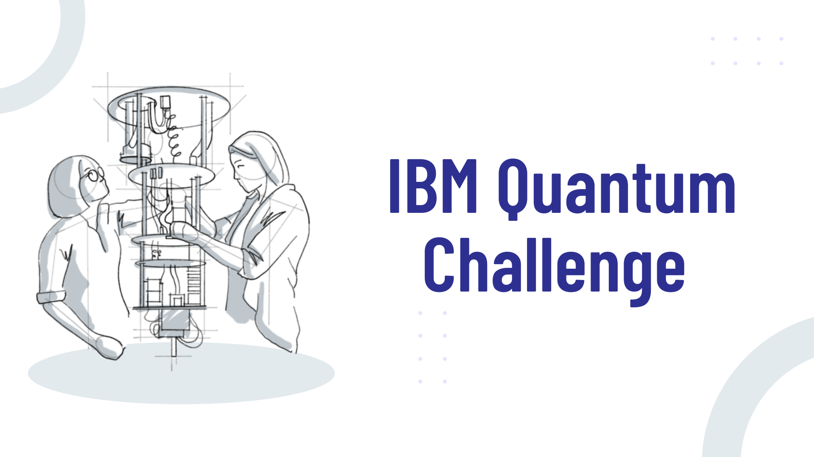

# IBM Quantum Challengeで学ぶ量子コンピューティング
IBM Quantum Challengeを題材とした量子コンピューティングの学習教材です。

IBM Quantum Challenge は IBM が主催する量子コンピューターのプログラミングコンテストのことで、2019 年から開催されています。  
オープンソースの量子開発キットの Qiskit を活用して、量子コンピューティングに関する基礎から応用までを学びながら腕を競っています。

本教材では過去の Quantum Challenge の問題を扱いながら量子コンピューティングを学ぶことを目的としています。
（教材ページは[こちら](https://quantum-tokyo.github.io/iqc-textbook/)）

## How to contribute
各問題の説明の補足や解説追加を対応中です。Contributionいただける方は[CONTRIBUTING.md](./CONTRIBUTING.md)をご覧ください。
